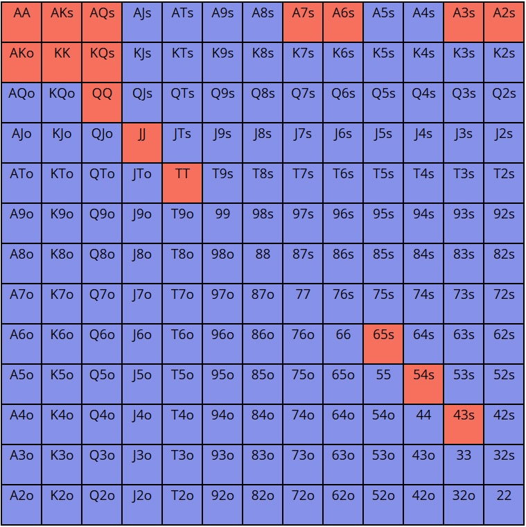

# Poker

Run a game of Texas Holdem poker, played by computer actors who can have their strategies programmed.


A strategy is used to decide between a range of possible actions in a single poker hand. At each decision point,
a strategy can incorporate any amount of information it can extract from the environment, to decide which action to take.

In order to support this decision making process, each actor has access to various utilities which can be used to estimate or calculate equity,
using combinations and math that most good poker players have committed to memory and can do intuitively in the heat of battle.

These utilities are also made available for general poker situation analysis away from the table.

Ultimately, the goal would be to arrive at a game theory optimal poker strategy using various approaches out there in the wild.

## Contributing

1. Clone this repo

```shell
$ git clone git@github.com:soederpop/poker.git
$ cd poker
$ npm install
```

See [Applications](#Applications) for more info about the available applications that can be run.

### Development Scripts

- `npm run dev` will start a development server, for both the backend API and frontend React application, which will open in your browser.
- `npm run build` will build the library and server code for distribution, and running in production
- `npm run play` will start the terminal based view of the game simulation. Follow the instructions on the screen for interacting with the game.
- `npm run console` will open up a REPL

## Project Structure

- The [server](server) folder contains a library for powering the various poker analysis and simulation tools.

- The [src](src) folder contains a React frontend application. This application is a workspace for viewing poker game simulations that are
  running, where the different actors are carrying out their programmed strategies. It provides you with various tools for comparing the equity
  of different hands or ranges of hands against other ranges of hands, as well as tools for browsing different board textures.

- There [server/api](server/api) folder contains an express.js server for the web app to talk to.

- The [src/client.js](src/client.js) module exposes a REST API client for talking to the API.

- The [server/app](server/app) folder contains a React app that runs in the terminal, powered by ink.

- The [test](test) folder contains some unit tests.

- The [scripts](scripts) folder contains various scripts, (e.g console.js, play.js). Run any one of these scripts by typing `skypager $script` e.g. `skypager play`

## Classes

### [Range](server/Range.js)

It is common in most poker literature about texas holdem starting hands to represent them as a chart like



This represents all possible combinations of a 52 card deck, with ranks `2,3,4,5,6,7,8,9,T,J,K,Q,A` and suits `H,D,C,S` .

There are 169 possible generic combinations (e.g. `AKs,AKo,AA` ) and 1326 possible sorted combinations (e.g. `AKs` and `KAs` are the same.)

Each combination is represented as an array of cards with attributes.

```javascript
[ { suit: 20, rank: 1, name: '3c' },
  { suit: 20, rank: 0, name: '2c' },
  toJSON: [Function: toJSON],
  toString: [Function: toString],
  has: [Function: has],
  name: '3c2c',
  csv: '3c,2c',
  normalized: '32s',
  showdown: 1873,
  strengthVsOpponents: [ 35, 24, 18, 15, 13, 12, 11, 10 ],
  vsOnePlayer: 35,
  vsTwoPlayers: 24,
  vsThreePlayers: 18,
  averageEquity: [ 35, 24, 18, 15, 13, 12, 11, 10 ],
  pair: false,
  offsuit: false,
  suited: true,
  gap: 1,
  rank: 1,
  kicker: 0
]
```

These attributes can be used to match combinations against common hand range notations found in poker literature, e.g.

- `22+` means any pocket pair 2 or better
- `22-99` means any pocket pair 2-9
- `KTs+` means any suited combination of a King and a card greater than ten (e.g. `J,Q,A`)
- `AKo` means any unsuited combination of an Ace and a King
- `56s+` means any suited connector with a high card greater than 8 (e.g. `56s`,`78s`,`98s`,`T9s`,`JTs`,`QJs`,`KQs`,`AKs`)
- `56s-T9s` means any suited connector above, up to and including `T9s`

Or combine some of of the above: `22-99,KTs,AKo,56s`

```javascript
import { Range } from "pokurr";
const range = new Range(`22-99,KTs+,QTs+`);
```

With this object, you can learn a lot about that range. What hands are in it, how many combinations it is made up of, etc.

David Sklansky is a popular poker author and one of the pioneers of poker math, and he defined some common ranges:

```javascript
export const SKLANKSY_RANGES = {
  "1": "AA,KK,QQ,JJ,AKs",
  "2": "TT,AQs,AJs,KQs,AKo",
  "3": "99,JTs,QJs,ATs,AQo",
  "4": "T9s,KQo,88,QTs,98s,J9s,AJo,KTs",
  "5": "77,87s,Q9s,T8s,KJo,QJo,JTo,76s,97s,A9s,A8s,A7s,A6s,A5s,A4s,A3s,A2s,65s",
  "6": "66,ATo,55,86s,KTo,QTo,54s,K9s,J8s,75s",
  "7": "44,J9o,64s,T9o,53s,33,98o,43s,22,K9s,K8s,K7s,K6s,K5s,K4s,K3s,K2s",
  "8": "87,A9o,Q9o,76o,42s,32s,96s,85s,J8o,J7s,65o,54o,74s,K9o,T8o"
};
```

Each of the hands in these groups have a similar average equity vs other hands in other groups.

Sklansky defined the following categories (I think this is close, I'd have to double check)

- ultra strong (hands in group 1)
- strong (hands in group 1 or 2)
- medium (hands in group 1 - 5)
- loose (hands up to group 7)
- any two cards (hands 8 and above)

The range class provides access to these groups for convenience:

```javascript
Range.sklansky.ultraStrong;
```

You can compare two ranges to see their equity vs one another:

```javascript
const { strong, medium } = Range.sklansky;

strong.compare(medium).then(results => {
  console.log(results);
});
```

Even when certain cards are on the board:

```javascript
strong.compare(medium, { board: "Ah9d3c" });
```

Or cards are in your hand already (your cards block other possible combos from being in your opponents hand)

```javascript
strong.compare(medium, { board: "Ah9d3c", deadCards: ["8d", "9c"] });
```

#### Enumeration of flops, turns, and rivers

Similar to how the Range keeps track of possible two card combos, it keeps track of 3,4,5 combos (these are huge in number though.)

Each flop, turn, or river, is analyed to tell us not only what cards it contains, but various characteristics about its "texture"

e.g. is there an ace? are there three of the same suit? is there a pair on the board? is there a possible straight? is it three low cards? three medium cards, three broadway (aka face cards), so on and so forth.

these flop features combine to make up what is known as flop texture. Certain flop textures are more likely to improve some ranges more than others. It is possible to use all of this information to estimate your equity
in any given situation against a certain range. I was inspired by this paper [Estimating THe Strength Of Poker Hands by integer linear programming techniques](https://www.researchgate.net/publication/280085229)

```javascript
export const FLOP_FILTERS = {
  maxRank: "cardRank",
  name: "string",
  minRank: "cardRank",
  uniqSuits: "number",
  ranks: "array",
  uniqRanks: "number",
  flushPossible: "boolean",
  flushDraw: "boolean",
  rainbow: "boolean",
  sameRank: "boolean",
  paired: "boolean",
  trips: "boolean",
  hasAce: "boolean",
  hasKing: "boolean",
  hasQueen: "boolean",
  hasJack: "boolean",
  hasTen: "boolean",
  numberOfBroadwayCards: "number",
  threeMediumCards: "boolean",
  threeSmallCards: "boolean",
  gaps: "array",
  openEnded: "boolean",
  possibleStraights: "boolean"
};
```

Many flops are the same texture: `2c3c4c`, `2s3c4c` even though the cards are different.

Each unique combination of flop features, is represented with a hash value called `baseTexture`

There are many more flops which are uncoordinated (no connecting cards, no straights on board, etc) than there are flops that have three of the same suit.

These base texture hashes can be used to sample the possible flops, instead of enumerating over all of the same ones, when the result is going to be the same.

For example, `AhKh` wins the same amount vs `QcQd` as `AsKs` does against `QhQc` so enumerating both possibilities is a waste of time. The same is true for flops, turns, etc.

The specific suits don't matter, the number of possible combinations given the cards known is more important and luckily a much smaller space.

### [Game](server/Game.js)

The Game class can instantiate a poker table with 2-10 players, and will keep track of the current order of play and the different actions taken, as well as the current status of each player,
(how many chips do they have? what cards do they hold? which position are they in for this round of play?). It will also calculate equity, count possible outs, and rank hands after the flop is dealt.

It will also give some useful stats about the current hand:

- how many big blinds does the player have in their stack?
- how much is in the pot?
- how much is the current player required to put in the pot to advance?
- what are the pot odds being offered?
- what is the effective stack size?
- how much has the player currently invested?

The Game will go around and around to each player and have the player make a decision

### [Actor](server/Actor.js)

The Actor class is used to control the logic a player in a `Game` will use to provide the game with its decision about how to proceed in the hand, e.g. (`check`, `bet`, `fold`, `call`)

It will also give you a view of the game from the perception of the actor, who by the rules of the game won't know all of the cards held by the other players.

At best, an actor can guess about what another actor's Range is (and can incorporate the history of their play together to deduce that range to some degree of accuracy)

Generic strategies can be defined as strategy profiles. An actor starts with one of these (by default, will be a random.)

Each decision can be made asynchronously, and take as much time as necessary.

One of my goals would be to implement the algorithm described here [https://science.sciencemag.org/content/early/2019/07/10/science.aay2400](https://science.sciencemag.org/content/early/2019/07/10/science.aay2400) which is about one of the first AI to be able to beat a multiplayer game of 6 handed poker.

### [HandEquity](server/HandEquity.js)

A generic utility for calculating the equity of one hand vs another.

## Applications

This project consists of a few different applications.

### Game API

The Game API is an express.js based JSON API that provides access to the game engine, and an interface to the Range utility described above

### Web Application

The Web Application gives a web based poker table which can be used to observe the bots playing against one another. It is very similar to watching poker on TV,
where you can see everyone's cards.

```shell
$ yarn serve
$ yarn dev:webapp
```

It includes a number of UI tools for analyzing hand ranges and combinations, calculating equity, exploring flop textures, etc.

### Terminal CLI Application

The same view of the game server, but using ANSI art in the terminal. Powered by ink and React

```shell
$ yarn play
```

### REPL

The REPL gives you access to all of the classes, game, in a JavaScript console you can use to explore the different ranges, combinations, and utilities

```shell
$ yarn console
```

## Additional Reading

- [Upswing Poker Article #1](https://upswingpoker.com/gto-poker-game-theory-optimal-strategy/)
- [holdem resources calculator](https://www.holdemresources.net/hrc/download)
- [icmizer](https://www.icmpoker.com/signup/)
- [piosolver](https://www.piosolver.com/)
- [card runners ev calculations with decision trees](https://www.cardrunnersev.com/)
- [PokerSnowie](https://www.pokersnowie.com/features.html)
- [Regret Minimizers](https://blog.ml.cmu.edu/2019/08/02/regret-circuits-composability-of-regret-minimizers/)
